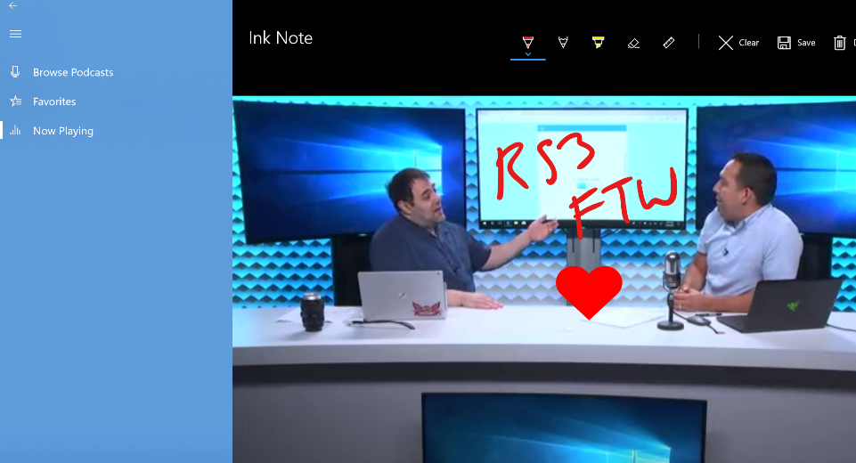

<!---
  category: Fluent
-->
# BuildCast Video Player UWP Sample
BuildCast is an end-to-end sample built to showcase the [Microsoft Fluent Design System](https://fluent.microsoft.com/) as well as other capabilities of the Universal Windows Platform. It permits browsing, downloading and playback of select video podcasts including a sampling of the most popular ones from Channel 9 as well as some popular Windows tech enthusiast feeds. It has other features such as ink notes, bookmarks and remote playback. This sample was initially shown and discussed at the 2017 Build conference during the [Build Amazing Apps with Fluent Design](https://channel9.msdn.com/Events/Build/2017/B8034) talk.  

# Features
At a high level this sample demonstrates usage of:
- Fluent design system (Acrylic material, Reveal highlight, Connected animations, ParallaxView etc)
- XAML controls and features (NavigationView, swipe commanding, context menu with icons and SVG assets, LoadedImageService, conditional XAML etc)
- Media playback including picture-in-picture and fullscreen views
- Inking and smart ink
- Project Rome and AppServices 
- Background download service, Entity Framework and SQLite
- Windows composition APIs (InteractionTracker, implicit animations, scene lighting)
- Notifications with progress bar
- Share contract 
## Run the sample

### Prepare your environment

This sample requires Visual Studio 2017 with Update 5 and the Windows 10 Software Development Kit (SDK) version 16299, Windows 10 OS - Fall Creators Update.

* [Get a copy of Visual Studio 2017 Update 4 with support for building Universal Windows apps]( https://www.visualstudio.com/downloads/) [includes SDK 16299]

* [Get the latest Windows 10 Fall Creator's Update](https://www.microsoft.com/en-us/windows) [10.0.16299.0 or later]

* [Get the Windows 10 Insider SDK 16299](https://developer.microsoft.com/en-US/windows/downloads/windows-10-sdk) as a standalone download.

Additionally, to receive the latest updates to Windows and the development tools, and to help shape their development, join the [Windows Insider Program](https://insider.windows.com/ "Become a Windows Insider").
### Run
After opening the Visual Studio solution, set your startup project as **BuildCast**, the architecture to AMD64 or x86, and press F5 to run.

## Code at a glance

The table below shows the platform features used in the application and where abouts to find them in the sample. 

### Known Issues
- Only ink strokes are preserved in ink notes, glyphs recognized via smart ink are not currently persisted.
- In this iteration, BuildCast has been primarily optimized for desktop usage.
- There may be issues deploying to XBOX due to a platform bug that is being investigated.
- Duplicate entries may appear in search results.  This is due to the fact that they are listed in multiple RSS feeds.
- Download progress is only reported via action center, there is no in-app UX for that currently.
- Download progress reported via toasts / action center will not update when the app quits, even though the download will proceed using background transfer service 
- Whilst video playback continues when navigating away from the player, there is no in-app picture-in-picture currently hence you'll only hear audio play back.
- When downloads complete, views will not automatically update to show 
- The MVVM pattern is used for some of the app UX but not all currently (eg it isn't used in the media playback aspects)
- There are no media transport controls present in the picture-in-picture view currently
- The downloads page doesn't show an Empty message when there are no downloads present
- A number of warnings have not been addressed
- Things that didn't make it from the Build talk:
  - TreeView control: did not ship in the final Fall Creator's update
  - 360 video playback: this will come in a future update to the app
  - Spectrum analyzer component: this will come in a future update to the app

### App details
### Frameworks 
| Framework | Usage | Code file |
| :-------------- | :--------------  | --------------: |
| [Entity framework](https://docs.microsoft.com/en-us/dotnet/framework/data/adonet/ef/overview)				| ORM to store objects in SQLite       | [LocalStorageContext.cs](src\BuildCast\DataModel\LocalStorageContext.cs) |
| [SQLite in UWP](https://blogs.windows.com/buildingapps/2017/02/06/using-sqlite-databases-uwp-apps/)       | Primary mechanism for persistence    | N/A |
| [.NET Standard 2.0](https://blogs.msdn.microsoft.com/dotnet/2017/08/14/announcing-net-standard-2-0/)		| Provides System.Tuple                | [NowPlayingState.cs](src\BuildCast\DataModel\NowPlayingState.cs) |

### App features

| App feature | Description | Code file |
| :-------------- | :--------------  | --------------: |
| [Acrylic material](https://docs.microsoft.com/en-us/windows/uwp/style/acrylic)																						    | Acrylic material usage                             					| [Branded.xaml](src\BuildCast\Themes\Branded.xaml) |
| [Reveal highlight](https://docs.microsoft.com/en-us/windows/uwp/style/reveal)																								| Reveal highlight usage                             					| [CustomMTC.xaml](src\BuildCast\Controls\CustomMTC.xaml) |
| [NavigationView](https://docs.microsoft.com/en-us/windows/uwp/controls-and-patterns/navigationview)																        | NavigationView usage                               						| [NavigationRoot.xaml](src\BuildCast\Views\NavigationRoot.xaml) |
| [Connected animations](https://docs.microsoft.com/en-us/windows/uwp/style/connected-animation)																		    | Used in connected transitions between pages																										    | [FeedDetails.xaml.cs](src\BuildCast\Views\FeedDetails.xaml.cs) |
| [Inking](https://docs.microsoft.com/en-us/windows/uwp/input-and-devices/pen-and-stylus-interactions)														                | Ink annotation on video frame                      						| [InkNote.xaml.cs](src\BuildCast\Views\InkNote.xaml.cs) |
| [Smart Ink](https://docs.microsoft.com/en-us/windows/uwp/input-and-devices/pen-and-stylus-interactions)															        | Recognize and convert images to glyphs and emoji          | [InkNote.xaml.cs](src\BuildCast\Views\InkNote.xaml.cs) |
| [Emoji picker]()																																							| Select emoji                                       							| [InkNote.xaml.cs](src\BuildCast\Views\InkNote.xaml.cs) |
| [Context menus with icons](https://docs.microsoft.com/en-us/windows/uwp/controls-and-patterns/menus)																		| Context menus with icons                           							| [FeedDetails.xaml](src\BuildCast\Views\FeedDetails.xaml) |
| [Swipe commanding](https://docs.microsoft.com/en-us/windows/uwp/controls-and-patterns/collection-commanding)												                | Swipe controls on lists		   																																	        | [FeedDetails.xaml](src\BuildCast\Views\FeedDetails.xaml) |
| [Mnemonics/Access Keys](https://docs.microsoft.com/en-us/windows/uwp/input-and-devices/access-keys)												                        | Mnemonics usage                                    								| [EpisodeDetails.xaml](src\BuildCast\Views\EpisodeDetails.xaml) |
| [Command bar](https://docs.microsoft.com/en-us/windows/uwp/controls-and-patterns/app-bars)																			    | Command bar usage                                  								| [Player.xaml](src\BuildCast\Views\Player.xaml) |
| [Coordinated animations](https://docs.microsoft.com/en-us/windows/uwp/style/connected-animation)																	        | Used in connected transitions between pages																											| [FeedDetails.xaml.cs](src\BuildCast\Views\FeedDetails.xaml.cs) |
| [Conditional XAML](https://docs.microsoft.com/en-us/windows/uwp/debug-test-perf/conditional-xaml)																			| NavigationView loads based on OS version support																			| [NavigationRoot.xaml](src\BuildCast\Views\NavigationRoot.xaml) |
| [SVG](https://docs.microsoft.com/en-us/windows/uwp/input-and-devices/convert-ink-to-text)																	                | BuildCast logo on homepage																															    | [Home.xaml](src\BuildCast\Views\Home.xaml) |
| [Adaptive state triggers](https://blogs.msdn.microsoft.com/cdndevs/2015/06/26/uwp-new-features-of-visual-state-manager-part-1/)											| UI optimizations for assorted screen sizes                                  																											| [Home.xaml](src\BuildCast\Views\Home.xaml) |
| [ParallaxView](https://docs.microsoft.com/en-us/uwp/api/Windows.UI.Xaml.Controls.Parallaxview)														                    | Home screen parallax layout                       							| [Home.xaml](src\BuildCast\Views\Home.xaml) |
| [Lighting](https://docs.microsoft.com/en-us/uwp/api/Windows.UI.Composition.Effects.SceneLightingEffect)												                    | Buffering animation																																	| [BufferingVisualManager.cs](src\BuildCast\Helpers\BufferingVisualManager.cs) |
| [Interaction tracker](https://docs.microsoft.com/en-us/uwp/api/windows.ui.composition.interactions.interactiontracker)													| Interaction tracker                               				| [Timeline.cs](src\BuildCast\Controls\Timeline.cs) |
| [Layout animations](https://docs.microsoft.com/en-us/windows/uwp/composition/using-the-visual-layer-with-xaml)															| Layout animations																																		| [Home.xaml.cs](src\BuildCast\Views\Home.xaml.cs) |
| [Loaded Image Surface](https://docs.microsoft.com/en-us/uwp/api/windows.ui.xaml.media.loadedimagesurface)																    | Composition Surface for Images																													    | [CustomMediaPlayer.xaml.cs](src\BuildCast\Controls\CustomMediaPlayer.xaml.cs) |
|[Composition expression language](https://docs.microsoft.com/en-us/windows/uwp/composition/composition-animation)														    | Timeline animations																															    | [Timeline.cs](src\BuildCast\Controls\Timeline.cs) |
| [Implicit animations](https://docs.microsoft.com/en-us/windows/uwp/composition/using-the-visual-layer-with-xaml)														    | Poster frame fade out when video starts playing																										| [VisualHelpers.cs](src\BuildCast\Helpers\VisualHelpers.cs) |
| [Compact overlay mode](https://blogs.msdn.microsoft.com/universal-windows-app-model/2017/02/11/compactoverlay-mode-aka-picture-in-picture/)						        | Picture-in-picture support     									    | [ViewModeService.cs](src\BuildCast\Services\ViewModeService.cs) |
| [Full screen mode](https://docs.microsoft.com/en-us/uwp/api/Windows.UI.ViewManagement.ApplicationView#Methods_)												            | Full screen mode for video		   																	                                                | [ViewModeService.cs](src\BuildCast\Services\ViewModeService.cs) |
| [Share contract](https://docs.microsoft.com/en-us/windows/uwp/app-to-app/share-data)																						| Share the annotated frame                          						| [InkNote.xaml.cs](src\BuildCast\Views\InkNote.xaml.cs) |
| [Background transfer service](https://docs.microsoft.com/en-us/uwp/api/windows.networking.backgroundtransfer)																| Video download for offline viewing																													| [BackgroundDownloadHelper.cs](src\BuildCast\Helpers\BackgroundDownloadHelper.cs) |
| [BTS toast completion notifications](https://docs.microsoft.com/en-us/windows/uwp/controls-and-patterns/tiles-and-notifications-adaptive-interactive-toasts)				| Toast display upon background download completion  		| [BackgroundDownloadHelper.cs](src\BuildCast\Helpers\BackgroundDownloadHelper.cs) |
| [Toast progress bars](https://blogs.msdn.microsoft.com/tiles_and_toasts/2017/02/01/progress-ui-and-data-binding-inside-toast-notifications-windows-10-creators-update/)   | Visual download progress indicator                 						| [BackgroundDownloadHelper.cs](src\BuildCast\Helpers\BackgroundDownloadHelper.cs) |                                                                                   | [CodeFileName.extension](Folder/Folder/CodeFileName.extension#L25) |
| [App services](https://docs.microsoft.com/en-us/windows/uwp/launch-resume/how-to-create-and-consume-an-app-service)														| Support Rome based remote control																														| [RemotePlayService.cs](src\BuildCast\Services\RemotePlayService.cs) |
| [Media Composition API](https://docs.microsoft.com/en-us/uwp/api/Windows.Graphics.Imaging.BitmapEncoder)																	| Extract frame for Ink annotations from local file																																		| [PlayerService.cs](src\BuildCast\Services\PlayerService.cs) |
| [Template studio](https://blogs.windows.com/buildingapps/2017/05/16/announcing-windows-template-studio/)																	| Theming, settings model    																																| |
|

# Contributing

While we expect to at a later date, this project is not currently accepting contributions. For now, if you have any feedback or questions, please open an Issue on GitHub for the team. 

This project has adopted the [Microsoft Open Source Code of Conduct](https://opensource.microsoft.com/codeofconduct/).
For more information see the [Code of Conduct FAQ](https://opensource.microsoft.com/codeofconduct/faq/)
or contact [opencode@microsoft.com](mailto:opencode@microsoft.com) with any additional questions or comments

Copyright � Microsoft Corporation. All rights reserved.
This program/project is and its use is subject to the [MIT License](LICENSE)
